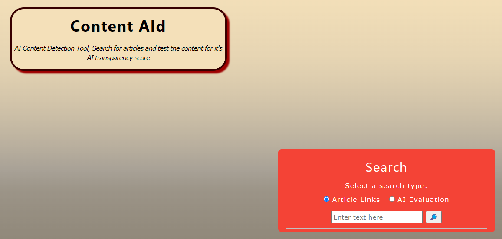
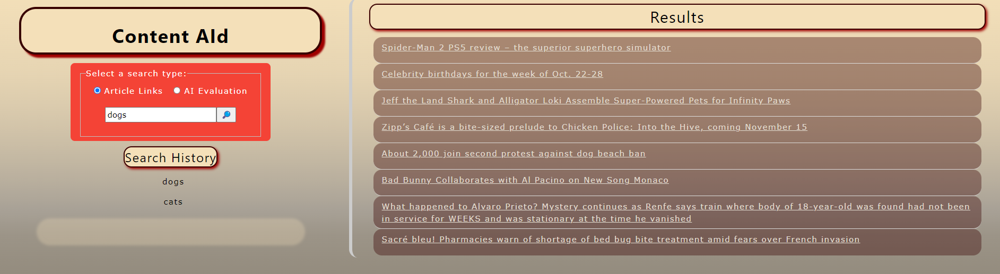

# Content AId

## Description
In a world increasingly inundated with ChatGPT and other AI chatbots, it is becoming harder and harder to identify human vs AI-generated content. That's why we created this web app: to help people discern computer-generated content from human-written. The main focus of the application is based around news sources because they publish content from a position of authority. We consider AI-generated news content to be disingenuous and believe it should be identified. The application will allow a user to enter a search term and be provided with a list of some of the most relevant news articles, conveniently displayed on the site. One can then follow the links to their sources, and if something is questionable, they can scan the text through the built-in AI Content Detector. This API will return a percent likelihood of something being AI-generated so the user can make a judgment about its authenticity.

## Features
- Multifunction Search box on the homepage for article searches or AI content scanning.
- Dynamic results table that gets populated with sources based on the search term.
- AI content scan input is available on both pages.
- Search history will display all searches and persist on page refresh.
- AI content scan will output a percent liklihood of given text being AI generated as well as dynamic messages, such as, "definitely AI" (40%>), "maybe AI" (40-60%), "likely not AI" (60%<).

*Preview of home page*

*Preview of results page*
## Usage
1. Enter a search term of your choosing into the search bar.
2. Select the "article links" button.
3. Click on the search icon.
4. You will be redirected to a new page displaying relevant links for you.
5. Follow any link you want for your research.
6. If you encounter some text you want to scan, copy and paste it into the input box on the left side of the page where the links are displayed.
7. This will return a percent likelihood that the content was generated with AI. Remember, the lower the percent, the more likely AI was used.
8. Use this information to make a judgment call on the validity of the content you are reading.

Technology Used         | Resource URL           | 
| ------------- |:-------------:| 
| HTML       | [https://developer.mozilla.org/en-US/docs/Web/HTML](https://developer.mozilla.org/en-US/docs/Web/HTML) | 
| CSS        | [https://developer.mozilla.org/en-US/docs/Web/CSS](https://developer.mozilla.org/en-US/docs/Web/CSS)      |   
| Git        | [https://git-scm.com/](https://git-scm.com/)     |    
| JavaScript | [https://developer.mozilla.org/en-US/docs/Web/JavaScript](https://developer.mozilla.org/en-US/docs/Web/JavaScript) |
| jQuery     | [https://jquery.com/](https://jquery.com/)  |
| Mithril    | [https://mithril.js.org/](https://mithril.js.org/)  |
| W3-CSS     | [https://www.w3schools.com/w3css/default.asp](https://www.w3schools.com/w3css/default.asp)  |
 
 [Visit the Deployed Site](https://stellyes.github.io/content-AId/)

 ## Credits
 - Ryan England ([GitHub Profile](https://github.com/stellyes))
 - James Waller ([GitHub Profile](https://github.com/DistantDig))
 - Andrew Hall ([GitHub Profile](https://github.com/Andrewchall92))
 
 
 
 ## License
 This project is licensed under the [MIT License](LICENSE).